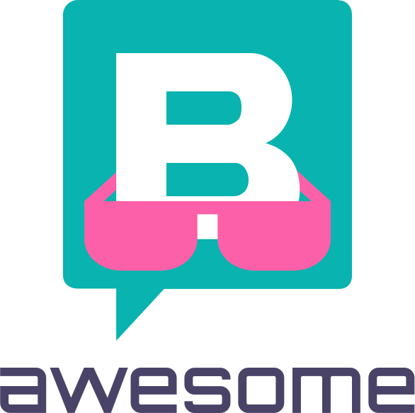

   
  
   
   

## Awesome Storyblok 

> A curated list of awesome things related to [Storyblok CMS](https://www.storyblok.com). 😏 .

The Only Headless CMS with a Visual Editor.

## Contents

- [Awesome Storyblok ](#awesome-storyblok-)
- [Contents](#contents)
  - [Official Resources](#official-resources)
  - [Community](#community)
  - [Tutorials](#tutorials)
    - [VueJS](#vuejs)
    - [NuxtJS](#nuxtjs)
    - [ReactJS](#reactjs)
    - [NextJS](#nextjs)
    - [GatsbyJS](#gatsbyjs)
    - [RemixJS](#remixjs)
  - [Starter Templates](#starter-templates)
  - [Tools](#tools)
  - [Field-Types](#field-types)
    - [Official](#official)
    - [Community](#community-1)
  - [Field Plugins](#field-plugins)
    - [Community](#community-2)
  - [Projects built with Storyblok](#projects-built-with-storyblok)
  - [Ambassadors](#ambassadors)
- [License](#license)

### Official Resources

- [Official Docs](https://www.storyblok.com/docs)
- [Content Delivery API](https://www.storyblok.com/docs/api/content-delivery)
- [Management API](https://www.storyblok.com/docs/api/management)
- [Changelog](https://www.storyblok.com/changelog)
- [Storyblok Status](https://status.storyblok.com/en/) - Status of the services provided by Storyblok.
- [Uptime](https://uptime.storyblok.com/) - Monitors the uptime of the APIs.

### Community

- [Twitter](https://twitter.com/storyblok)
- [Discord](https://discord.com/invite/WmMYYQp)
- [Youtube](https://www.youtube.com/c/storyblok-com)
- [Chat](https://www.storyblok.com) - Ask us anything in the chat on the storyblok website.

### Tutorials
[View all Tutorials](https://www.storyblok.com/tutorials)
#### VueJS

- [Add a headless CMS to VueJs in 5 minutes](https://www.storyblok.com/tp/add-a-headless-CMS-to-vuejs-in-5-minutes)
- [How to use the Storyblok Image Service with Vue.js](https://www.storyblok.com/tp/storyblok-image-service-vuejs)
- [Building a Store Finder with Storyblok and Vue.js](https://www.storyblok.com/tp/building-a-store-finder-with-storyblok-and-vue-js)
- [How to serve gated content with Storyblok private assets](https://www.storyblok.com/tp/how-to-serve-gated-content-with-storyblok-private-assets)
- [How to create a scheduled component using Vue.js?](https://www.storyblok.com/tp/how-to-create-a-scheduled-component-using-vue-js)

#### NuxtJS
- [Add a headless CMS to Nuxt 3 in 5 minutes](https://www.storyblok.com/tp/add-a-headless-CMS-to-nuxt-3-in-5-minutes)
- [The Storyblok Nuxt Ultimate Tutorial](https://www.storyblok.com/tp/storyblok-nuxt-ultimate-tutorial)
- [The complete guide to building a multilanguage website with Nuxt & Storyblok](https://www.storyblok.com/tp/nuxt-js-multilanguage-website-tutorial)
- [Create and Render Blog Articles in Storyblok and Nuxt](https://www.storyblok.com/tp/create-and-render-blog-articles-in-storyblok-and-nuxt)
- [Create Custom Components in Storyblok and Nuxt](https://www.storyblok.com/tp/create-custom-components-in-storyblok-and-nuxt)

#### ReactJS
- [Add a headless CMS to React in 5 minutes](https://www.storyblok.com/tp/headless-cms-react)
- [Create your Storyblok Field-Type Plugin using React](https://www.storyblok.com/tp/react-field-type-plugin)
- [How to render dynamic component defined in JSON using React](https://www.storyblok.com/tp/react-dynamic-component-from-json)
- [How to use Storyblok's GraphQL endpoint with React and Apollo](https://www.storyblok.com/tp/storyblok-graphql-react-apollo)

#### NextJS
- [Add a headless CMS to Next.js in 5 minutes](https://www.storyblok.com/tp/add-a-headless-cms-to-next-js-in-5-minutes)
- [The Storyblok Next.js Ultimate Tutorial](https://www.storyblok.com/tp/nextjs-headless-cms-ultimate-tutorial)
- [How to Build a Storefront with Next.js and BigCommerce](https://www.storyblok.com/tp/storefront-next-bigcommerce)
- [Deploy Next SSG with Storyblok to Cloudflare Pages](https://www.storyblok.com/tp/nextjs-cloudflare-deployment)
- [Using Image Service on Private assets with Next.js](https://www.storyblok.com/tp/image-service-private-assets)
- [Create Dynamic Menus in Storyblok and Next.js](https://www.storyblok.com/tp/create-dynamic-menus-in-storyblok-and-nextjs)

#### GatsbyJS
- [Add a headless CMS to Gatsby.js in 5 minutes](https://www.storyblok.com/tp/add-a-headless-cms-to-gatsby-5-minutes)
- [The Storyblok Gatsby Ultimate Tutorial](https://www.storyblok.com/tp/storyblok-gatsby-ultimate-tutorial)
- [The Complete Guide to Build a Full-Blown Multilanguage Website with Gatsby.js](https://www.storyblok.com/tp/gatsby-multilanguage-website-tutorial)
- [Create Dynamic Menus in Storyblok and Gatsby.js](https://www.storyblok.com/tp/create-dynamic-menus-in-storyblok-and-gatsby)
- [Using Gatsby Image in Storyblok](https://www.storyblok.com/tp/gatsby-image)
- [How to deploy to Gatsby Cloud Hosting](https://www.storyblok.com/tp/gatsby-cloud-hosting-guide)

#### RemixJS
- [Add a headless CMS to Remix in 5 minutes](https://www.storyblok.com/tp/headless-cms-remix)

### Starter Templates
- [GatsbyJS boilerplate](https://github.com/storyblok/gatsby-storyblok-boilerplate)
- [Nuxt boilerplate](https://github.com/storyblok/vue-nuxt-boilerplate)
- [Rails boilerplate](https://github.com/storyblok/rails-boilerplate)
- [SvelteJS boilerplate](https://github.com/storyblok/storyblok-svelte-boilerplate)
- [EmberJS boilerplate](https://github.com/storyblok/storyblok-ember-boilerplate)
- [ExpressJS boilerplate](https://github.com/storyblok/storyblok-express-boilerplate)
- [PreactJS boilerplate](https://github.com/storyblok/storyblok-preact-boilerplate)
- [ReactJS boilerplate](https://github.com/storyblok/storyblok-react-boilerplate)
- [RemixJS boilerplate](https://github.com/storyblok/storyblok-remix-boilerplate)
- [NextJS boilerplate](https://github.com/storyblok/react-next-boilerplate)
- [Gridsome boilerplate](https://github.com/storyblok/storyblok-gridsome-boilerplate)
- [ASP.net boilerplate](https://github.com/storyblok/asp-net-boilerplate)
- [Django boilerplate](https://github.com/storyblok/django-boilerplate)
- [11ty boilerplate](https://github.com/christianzoppi/storyblok-11ty) Storyblok 11ty boilerplate made by [@christianzoppi](https://github.com/christianzoppi).

### Tools

- [Tool Examples](https://github.com/storyblok/tool-examples) Our community repository to collect different tools and scripts to enhance the Storyblok workflow

### Field-Types

- [Field-Types Examples](https://github.com/storyblok/field-type-examples) Our community repository to collect different field-types to expand the Storyblok App 

#### Official

- [storyblok-nuxt](https://github.com/storyblok/storyblok-nuxt) - Multi-threaded generator command for Nuxt.js.

#### Community

- [storyblok-migrate](https://github.com/maoberlehner/storyblok-migrate) - Migration tool from Storyblok (Import/Export of schemas and content).
- [storyblok-rich-text-renderer](https://github.com/MarvinRudolph/storyblok-rich-text-renderer) - Rich Text Renderer for VueJS/NuxtJS
- [storyblok-rich-text-react-renderer](https://github.com/claus/storyblok-rich-text-react-renderer) - Rich Text Renderer for React
- [sb-mig](https://github.com/marckraw/sb-mig) - CLI for the Management API of Storyblok.
- [storyblok-mp-SDK](https://github.com/mikepenz/storyblok-mp-SDK) - Kotlin Multiplatform SDK to access the Storyblok API
- [storyblok-java-sdk](https://github.com/geilix10/storyblok-java-sdk) - Java SDK to access Storyblok API
- [vuestorefront-storyblok-sync](https://github.com/kodbruket/vsf-storyblok-sync) - Storyblok integration for Vue Storefront.
- [Storyblok typescript generator](https://gist.github.com/dohomi/cf5e3b783b695d91af6c8fb3ffcbcee0) - Storyblok typescript generator based on components.*.json file.
- [Laravel Storyblok](https://github.com/RicLeP/laravel-storyblok) - Makes working with Storyblok feel natural in Laravel.
- [nuxt-storyblok-queries](https://github.com/wearewondrous/nuxt-storyblok-queries) - Nuxt.js module to simplify queries to the Storyblok API.
- [nuxt-storyblok-router](https://github.com/wearewondrous/nuxt-storyblok-router) - Nuxt.js module to use storyblok routes instead of pages/ directory.
- [magento2-storyblok-integration](https://github.com/Media-Lounge/magento2-storyblok-integration/) - Magento 2 integration that allows you to create content-rich pages that are easily editable using the Storyblok interface.
- [storyblok-toolkit](https://github.com/storyofams/storyblok-toolkit) - Batteries-included toolset for efficient development of React frontends with Storyblok.
- [C# Storyblok](https://github.com/adliance/Storyblok) - C# SDK to access Storyblok API.
- [storyblok-api-go](https://github.com/teamexos/storyblok-api-go) - Golang SDK to access Storyblok API.
- [gatsby-storyblok-image](https://github.com/bejamas/gatsby-storyblok-image) - Gatsby community plugin to enable gatsby-image with Storyblok.

### Field Plugins

#### Community

- [component-fade-plugin](https://github.com/storyblok-extended/component-fade-plugin) - Plugin for easy 'fade' transition.
- [component-fade-plugin-react-consumer](https://github.com/storyblok-extended/component-fade-plugin-react-consumer) - HOC React component which consumes `component-fade-plugin` returned data.
- [storyblok-fieldtype-keyvaluepairs](https://github.com/apstechlead/storyblok-fieldtype-keyvaluepairs) - Plugin for adding Key-Value Pairs of data to a component.

### Projects built with Storyblok

- [Storyblok](https://www.storyblok.com) - The awesome website of Storyblok (of course).
- [SZ Brandstudio](https://www.sz-brandstudio.de/de/) - Agency website of SZ Brandstudio.
- [Story of AMS](https://storyofams.com) - Agency website of Story of AMS.

### Ambassadors
[Storyblok Ambassador Program](https://www.storyblok.com/ambassadors)

> Please don't hesitate to make a PR if you have more resources to share.

## License

